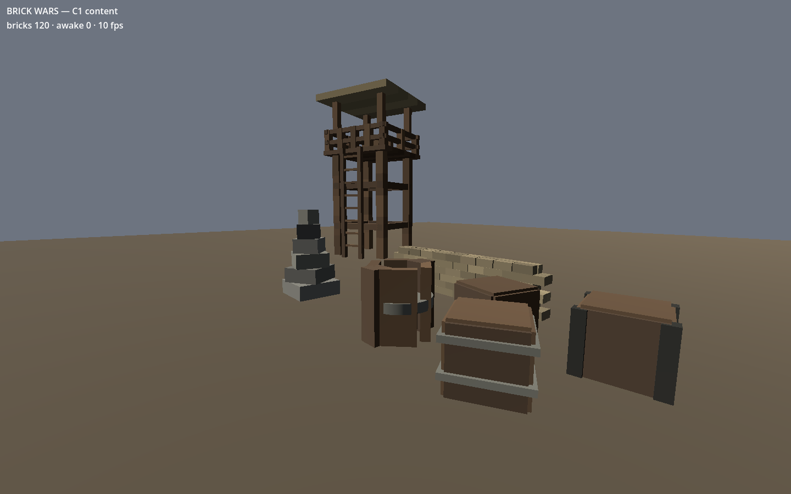

# Brick Wars — the game project

Godot 4.7.1 + Jolt. This is the rebuild; the old build is in `../archive/` and is read-only
history.

## Running it

Open `game/` in Godot and press play, or from the repo root:

    godot --path game                                    # play it
    godot --headless --path game res://tests/test_main.tscn   # run the tests
    ./tools/check.sh                                     # run the whole gate
    ./tools/screenshot.sh docs/c1_sandbox.png            # take a picture of it

There is still nothing to *do*. What there is, is a world made entirely out of files: a
sandbag wall, a watchtower, three crates and a barrel from `packs/core`, plus a cairn and a
reinforced crate from `packs/testpack` — every one of them read, resolved, validated and
built through the same path a workshop upload would take. The HUD counts bricks and how
many are still awake; that second number reaching zero and staying there is inherited from
C0 and still the cheapest proof the physics is behaving.

## How it's put together

`main.gd` makes a `Kernel` and boots it. That is all `main.gd` is allowed to do, forever.
The old build's `main.gd` reached 1,500 lines by starting as the place things got wired up
and becoming the place things got done.

`core/manifest.gd` lists the modules. `core/kernel.gd` works out what order they can start
in and starts them. Each module extends `core/module.gd`, declares its name, its
dependencies, and which milestone fills it in.

Modules talk to each other through `use()`, and `use()` refuses any module the caller did
not declare in `module_depends()`. That refusal is the point: declaring a dependency is a
deliberate act visible in a diff, and reaching for a global is not.

Ten of the thirteen modules are stubs. They say so — `module_is_stub()` returns true and
the test suite prints the count — so a skeleton is never mistaken for a core.

## What's real at C1

- **`physics`** — spawns bricks, verifies the three proven Jolt values at boot, and owns
  the delayed-sleep pattern. `SLEEP_DELAY_TICKS` is not a workaround to tidy up later; see
  `tests/cases/case_sleep_pattern.gd` for what happens without it.
- **`content`** — the palette, the material table, the slot registry, pack discovery and
  ordering, the reader, the `extends` resolver, the validator and the builder. This is the
  milestone: `core/mode/greybox.gd` used to build its wall with 114 `spawn_brick` calls and
  it has been deleted, because the same wall now comes out of
  `packs/core/wall_sandbag.json`.
- **`mode`** — `core/mode/sandbox.gd`: a plate, a sun, a camera, and a `LAYOUT` table
  naming which asset stands where. *Where* things go is still code, deliberately — a
  map format is C7's problem, and a table turns into a file with a reader rather than a
  rewrite.
- **`ui`** — two numbers in the corner.

Each module gets one line in the boot log via `summary()`, which is the cheapest diagnostic
in the project. If the palette loses a colour or the sandbox builds six assets instead of
seven, it shows up there rather than in a screenshot somebody has to squint at — and the
mass column is how the 540 kg sandbag got caught.

## Rules that are enforced, not suggested

- No file over 300 lines. Checked by `tools/check.sh`.
- Every `*_module.gd` under `core/` appears in `core/manifest.gd`. Also checked — a module
  file nobody listed would otherwise sit there quietly doing nothing.
- The three physics values in `project.godot` match the proven ones. Checked at boot *and*
  in the suite, because a drift there reads as "the game feels wrong now" six weeks later
  and nobody thinks to open a `.godot` file.
