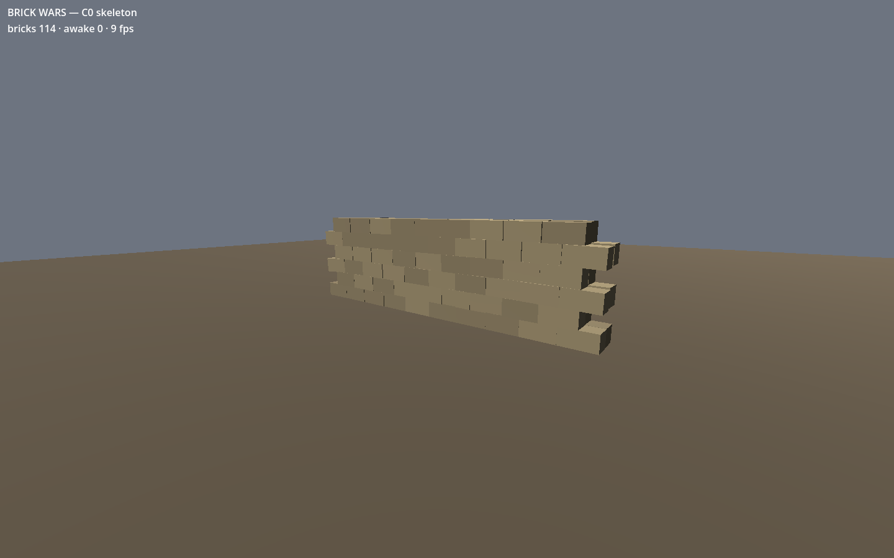

# Brick Wars — the game project

Godot 4.7.1 + Jolt. This is the rebuild; the old build is in `../archive/` and is read-only
history.

## Running it

Open `game/` in Godot and press play, or from the repo root:

    godot --path game                                    # play it
    godot --headless --path game res://tests/test_main.tscn   # run the tests
    ./tools/check.sh                                     # run the whole gate
    ./tools/screenshot.sh docs/c0_greybox.png            # take a picture of it

At C0 there is nothing to *do* — a wall of 114 bricks drops, settles, and goes to sleep,
and the HUD tells you how many are awake. That number reaching zero and staying there is
the entire point of the milestone.

## How it's put together

`main.gd` makes a `Kernel` and boots it. That is all `main.gd` is allowed to do, forever.
The old build's `main.gd` reached 1,500 lines by starting as the place things got wired up
and becoming the place things got done.

`core/manifest.gd` lists the modules. `core/kernel.gd` works out what order they can start
in and starts them. Each module extends `core/module.gd`, declares its name, its
dependencies, and which milestone fills it in.

Modules talk to each other through `use()`, and `use()` refuses any module the caller did
not declare in `module_depends()`. That refusal is the point: declaring a dependency is a
deliberate act visible in a diff, and reaching for a global is not.

Ten of the thirteen modules are stubs. They say so — `module_is_stub()` returns true and
the test suite prints the count — so a skeleton is never mistaken for a core.

## What's real at C0

- **`physics`** — spawns bricks, verifies the three proven Jolt values at boot, and owns
  the delayed-sleep pattern. `SLEEP_DELAY_TICKS` is not a workaround to tidy up later; see
  `tests/cases/case_sleep_pattern.gd` for what happens without it.
- **`mode`** — builds the grey box world. Thrown away entirely when C1 can build a wall
  from JSON, which is why nothing in `core/mode/greybox.gd` is worth arguing about.
- **`ui`** — two numbers in the corner.

## Rules that are enforced, not suggested

- No file over 300 lines. Checked by `tools/check.sh`.
- Every `*_module.gd` under `core/` appears in `core/manifest.gd`. Also checked — a module
  file nobody listed would otherwise sit there quietly doing nothing.
- The three physics values in `project.godot` match the proven ones. Checked at boot *and*
  in the suite, because a drift there reads as "the game feels wrong now" six weeks later
  and nobody thinks to open a `.godot` file.
